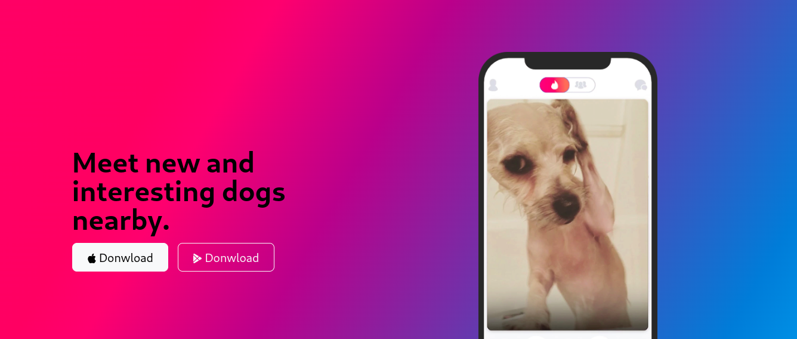

# TinDog - Dog Dating Website

**TinDog** is a fictional dog dating website designed to help pups find their perfect match. This landing page is built using **Bootstrap**, ensuring a responsive and appealing design across all devices.

## Table of Contents
- [Project Overview](#project-overview)
- [Features](#features)
- [Technologies Used](#technologies-used)
- [Installation](#installation)
- [Usage](#usage)
- [Screenshots](#screenshots)
- [Credits](#credits)

## Project Overview
TinDog is a fun and interactive landing page showcasing a dog dating platform. It highlights the features of the service, user testimonials, and pricing plans, aiming to create an engaging and enjoyable user experience.

## Features
- **Responsive Design**: The page is fully responsive, adapting seamlessly to mobile, tablet, and desktop devices.
- **Hero Section**: A bold and inviting hero section with a catchy tagline and call-to-action buttons.
- **Services**: Display of the main features of the TinDog platform.
- **Testimonials**: Reviews from pet owners who found the perfect match for their dogs.
- **Pricing Plans**: Easy-to-understand pricing options with different membership levels.
- **Footer**: A simple and clean footer with links to social media profiles.

## Technologies Used
- **HTML5**
- **CSS3**
- **Bootstrap 5**

## Installation
To run this project locally, follow these steps:

1. Clone the repository:
   ```bash
   git clone https://github.com/your-username/tindog-landing-page.git

2. Navigate to the project directory:
      ```bash
   cd tindog-landing-page

3. Open the index.html file in your browser:
      ```bash
   open index.html

## Usage
- **Explore the different sections of the landing page, including the features, testimonials, and pricing plans.**
- **The page is fully responsive, allowing it to be viewed on any device, from mobile phones to desktops.**
- **Use the navigation bar to easily move between sections, and enjoy the clean, modern design powered by Bootstrap.**

## Screenshots


## Credits
**This landing page was designed and developed using Bootstrap for responsive design. Special thanks to:**
- **Bootstrap for providing an excellent framework for building responsive websites.**
- **The TinDog concept was inspired by the idea of creating a fun and playful way to connect dogs with potential friends.**
- **I was able to build this landing page as part of the [Complete Web Development Bootcamp](https://www.udemy.com/course/the-complete-web-development-bootcamp/?couponCode=ST14MT101024) 
 on Udemy.**
